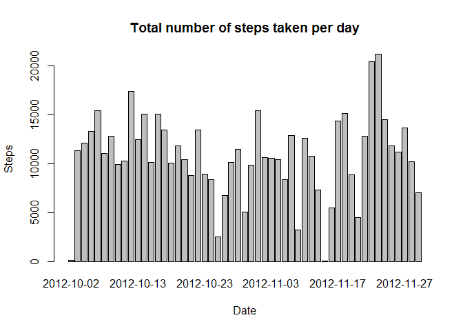
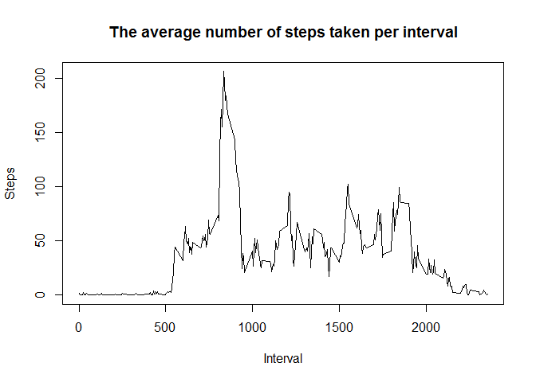

# Reproducible Research: Peer Assessment 1

This report is written for the first assessment in the Reproducible Research course.  
  
## Loading and preprocessing the data
The data for this assignment was downloaded from the course web site at 17:12 on octber 18 2015. The description of the data as posted on the course website:  
*The variables included in this dataset are:*  
*    steps: Number of steps taking in a 5-minute interval (missing values are coded as NA)*  
*    date: The date on which the measurement was taken in YYYY-MM-DD format*  
*    interval: Identifier for the 5-minute interval in which measurement was taken*  
* The dataset is stored in a comma-separated-value (CSV) file and there are a total of 17,568 observations in this dataset.*  
  
After downloading the data, it is loaded into R.  

```r
activity <- read.csv("activity.csv")
```
Then the column with the dates is transformed into a date format.

```r
activity$date <- as.POSIXct(activity$date)
```

## What is mean total number of steps taken per day?
TO answer this question the data has to be aggregated by day first.  

```r
stepsday <- aggregate(steps ~ date, data = activity, FUN = sum, na.rm=TRUE)
```
After that we make a histogram of the total number of steps taken each day.  


```r
barplot(stepsday$steps,
        names.arg=stepsday$date,
        main="Total number of steps taken per day",
        xlab="Date",
        ylab="Steps")
```

 
And we calculate the mean and median total number of steps taken per day.

```r
meansteps <- mean(stepsday$steps)
mediansteps <- median(stepsday$steps)
```
The mean number of steps per day is 1.0766189\times 10^{4}.  
The median number of steps per day is 10765.  

## What is the average daily activity pattern?
A time series plot is made (i.e. type = "l") of the 5-minute interval (x-axis) and the average number of steps taken, averaged across all days (y-axis).  
But to make the plot we need to aggregate the data first.  

```r
stepsinterval <- aggregate(steps ~ interval, data = activity, FUN = mean, na.rm=TRUE)
```
Now we can make the plot of the average number of steps taken, averaged across all days.  

```r
plot(stepsinterval, type = "l", main="The average number of steps taken per interval", xlab="Interval", ylab="Steps")
```

 

So which 5-minute interval, on average across all the days in the dataset, contains the maximum number of steps?

```r
stepsinterval$interval[which.max(stepsinterval$steps)]
```

```
## [1] 835
```

## Imputing missing values
Note that there are a number of days/intervals where there are missing values (coded as NA). The presence of missing days may introduce bias into some calculations or summaries of the data.  
  
The total number of missing values in the dataset (i.e. the total number of rows with NAs)

```r
sum(is.na(activity))
```

```
## [1] 2304
```

We want to know the effect if we replace the NA's by something else. For this assignment we replace the na's by the average number of steps taken, averaged across all days (see the last question).

```r
activity <- merge(activity, stepsinterval, by = "interval", suffixes = c("", 
    ".y"))
nas <- is.na(activity$steps)
activity$steps[nas] <- activity$steps.y[nas]
activity <- activity[, c(1:3)]
```
Now we reproduce the histogram of the total number of steps taken each day.

```r
stepsday2 <- aggregate(steps ~ date, data = activity, FUN = sum, na.rm=TRUE)
barplot(stepsday2$steps,
        names.arg=stepsday2$date,
        main="Total number of steps taken per day",
        xlab="Date",
        ylab="Steps")
```

 
And we calculate the mean and median total number of steps taken per day.

```r
meansteps2 <- mean(stepsday2$steps)
mediansteps2 <- median(stepsday2$steps)
```
The mean number of steps per day is 1.0766189\times 10^{4}, which was 1.0766189\times 10^{4} with the NA's.  
The median number of steps per day is 1.0766189\times 10^{4}, which was 10765 with the NA's.  
Replacing the NA's with the average number of steps taken, averaged across all days barely seems to impact the estimates. The differences are really small.

## Are there differences in activity patterns between weekdays and weekends?
To answer this question we use the dataset with the filled-in missing values.  
  
We introduce a new factor into the dataset with two levels - "weekday" and "weekend" indicating whether a given date is a weekday or weekend day. Due to dutch settings: zaterdag= Saturday and zondag = Sunday.

```r
activity$week <- ifelse(weekdays(activity$date) == "zaterdag" | weekdays(activity$date) == "zondag" ,"weekend","weekday")
```

A panel plot containing a time series plot (i.e. type = "l") of the 5-minute interval (x-axis) and the average number of steps taken, averaged across all weekday days or weekend days (y-axis).

```r
par(mfrow = c(2, 1))
for (weekweekend in c("weekend", "weekday")) {
    stepsweekweekend <- aggregate(steps ~ interval, data = activity, subset = activity$week == 
        weekweekend, FUN = mean)
    plot(stepsweekweekend, type = "l", main = weekweekend)
}
```

 


